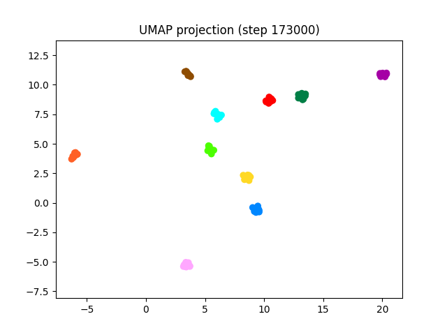
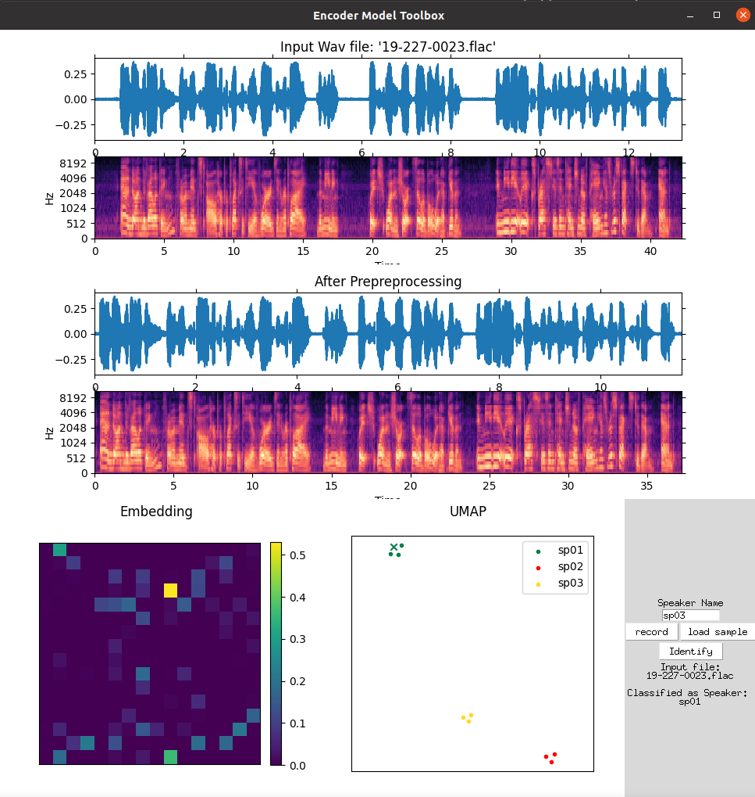

# DeepLearning_Project_VoiceClassification 
This repo is the course project for ECE9123 Deep learning See the pdf file for full report.

## Environment Requirements
- Python 3.7
- PyTorch
- ffempeg
- Run `pip install -r requirements.txt`

## Model, Data Preprocessing and Training
This part of code and implementation is the encoder part of the project [Real-Time-Voice-Cloning](https://github.com/CorentinJ/Real-Time-Voice-Cloning), including the preprocessing and training scripts.
Based on the scripts, we trained our own encoder model in './encoder/saved_models/my_run.pt' for 173,001 steps. The result performance can be visualized from the UMAP projection of 10 speakers (10 utterances each):

## GUI
We also write our own GUI tool for sample classification in gui.py.

The GUI allows you to load or record utterance training samples with labels. It will show the preprocessing process and the output embedding of the model. After loading few samples, user can use 'identify' button to load a testing sample and the progrom will show the classification result at the bottom-right. Besides, it will also plot the UMAP projection of historical input samples, training sample will be marked with '.' and the testing sample will be marked with 'x'.
